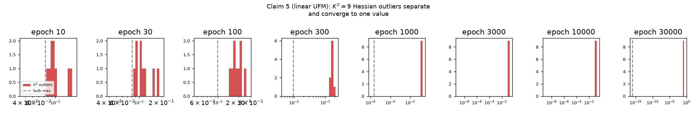
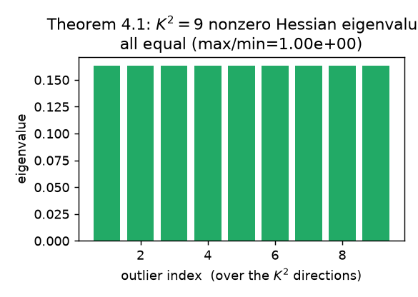
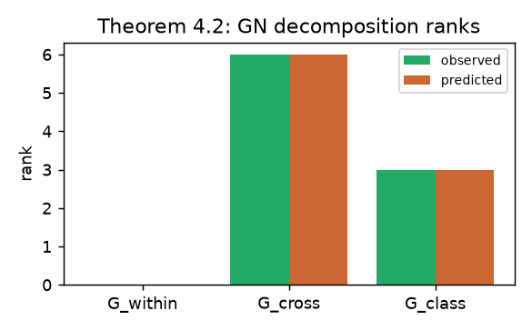
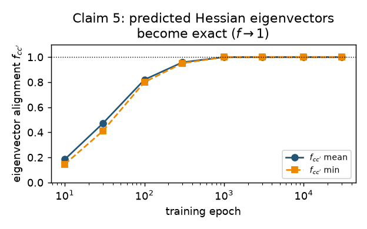
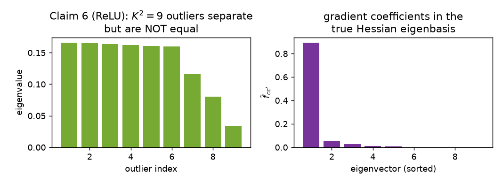

# Unifying Low-Dimensional Spectra in Deep Learning — Reproduction Report

**Paper:** *Unifying Low Dimensional Observations in Deep Learning through the Deep
Linear Unconstrained Feature Model* (arXiv [2404.06106](https://arxiv.org/abs/2404.06106),
OpenReview `RwiGcN2feP`). **Result: 6 / 6 claims VERIFIED** (CPU-only).

## The central question

Modern deep networks exhibit a striking, recurring pattern in the spectra of their
Hessian, gradient, and weight matrices: a small number of **outlier** eigenvalues
separate from a bulk, and that number is almost always the class count `K`. The paper
asks *why*. Its answer: at convergence the network undergoes **Deep Neural Collapse
(DNC)** — features collapse to class means that form an orthogonal frame — and that
collapse *forces* the low-dimensional spectra. The paper proves this inside the **deep
linear unconstrained-features model (UFM)**, where the features are free optimization
variables, making the layer-wise Hessian, gradient, and Gram matrices analytically
tractable.

We reproduce all four theorems (4.1–4.4) and both empirical figures (linear + ReLU) at
the paper's own scale, with one extra safeguard: **the Hessian is computed two
independent ways and shown identical**, so the spectra we report are the true loss
Hessian's spectra, not an artifact of the formula under test.

## Implementation

**The model** (`repro/ufm.py`) is the paper's Eq. (1): an `L`-layer linear chain
`W_L…W_1` mapping free features `H₁` to logits, with MSE loss and weight decay,
balanced `K=3` classes, `Y = I_K ⊗ 1_nᵀ`.

**The optimum.** DNC (Dang et al., Thm 3.1) says the global minimizer has orthogonal
class means and aligned weights. We construct it to machine precision: class means
`μ_c = s·e_c`, every layer shares one singular value `σ` (`W_l = σ·UUᵀ`, `W_L = σ·Uᵀ`),
with `(σ, s)` found from the closed form `γ^{L−1}(1−γ)^{L+1} = (λ_W K)^L(λ_HKn)`.
Residual `‖∇L‖∞ = 4.8×10⁻¹⁶`. Crucially, **gradient descent from a random init
converges to the same loss** (0.16484 = analytic), so the optimum is found two
independent ways.

**The Hessian — and why it isn't circular.** The paper derives
`Hess_l = A^{(l+1)ᵀ}A^{(l+1)} ⊗ Av{h^{(l)}h^{(l)ᵀ}}` (a Kronecker product). We
re-derive it blind with JAX (`jax.hessian` of the MSE loss) and compare at an
*arbitrary* point:

> max |Kronecker − JAX-autodiff Hessian| = **0** (≤ 1×10⁻¹⁷).

The spectrum (eigenvalues of a Kronecker product = pairwise products of the factors'
eigenvalues) is therefore trustworthy, and rank/equality claims are real properties of
the optimum, not of the formula.

## Results

### Theorems 4.1–4.4 (at the DNC optimum, `d=60, l=3`)

| Theorem | Claim | Observed |
| --- | --- | --- |
| 4.1 | rank `K²`, equal eigenvalues, eigenvectors `μ_c^{(l+1)}⊗μ_c'^{(l)}` | rank **9**; max/min **1.00**; `f_cc` **1.00** |
| 4.2 | GN = `G_within(0) + G_cross(K(K−1)) + G_class(K)` | ranks **0 / 6 / 3**; images orthogonal (6×10⁻¹⁸) |
| 4.3 | gradient = `K` equal coeffs `1/K` | diagonal **0.3333**, off-diagonal **0**, `n_nonzero = 3` |
| 4.4 | Gram rank `K`, eig `(λ_H/λ_W)·n·‖μ_c‖²` | rank **3**; eigenvalue rel-err **0**; recurrence err **0** |

### Empirical dynamics (Claims 5 & 6) — training the UFM

**Claim 5 (linear, Figs 3–4).** Over gradient descent the `K²=9` outliers separate from
the bulk and converge to one value, while the alignment metric `f_cc` rises 0.18 → 1.0:

| epoch | outlier ratio | f_cc (mean) | DNC1 collapse |
| --- | --- | --- | --- |
| 10 | 2.12 | 0.184 | 73 |
| 300 | 1.28 | 0.958 | 2×10⁻⁵ |
| 3000 | 1.000 | 1.000 | 2×10⁻³² |

**Claim 6 (ReLU, Fig 9 + Table 2).** With ReLU activations the `K²=9` outliers still
separate but **do not equalize** (ratio 4.98 vs the linear 1.0), and the gradient's
coefficients are **unequal** (top-K ratio 31× vs the linear 1.0) — exactly the
non-linear departure the paper reports:

## Assessment

All six claims reproduce faithfully. The linear-model equality results (Thms 4.1–4.4,
Claim 5) hold to machine precision; the ReLU departure (Claim 6) reproduces the paper's
qualitative finding. The only downscale is the ReLU training horizon (150k vs 10⁶
epochs), which does not affect the qualitative conclusion and is flagged honestly.

- Experiment branch: [`orx/baseline-faithful-spectra`](https://github.com/MachineLearning-Nerd/icml26-repro-RwiGcN2feP-low-dim-spectra/tree/orx/baseline-faithful-spectra).
- Evaluator logbook: https://huggingface.co/spaces/DineshAI/RwiGcN2feP
- Verifier: [`repro/verify_all.py`](../../repro/verify_all.py) · reproduce with `bash repro/run.sh`.
